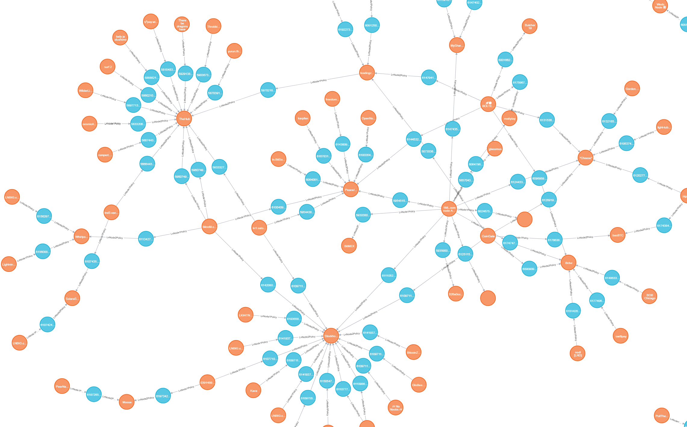

# ln_neo4j
Lightning Network Neo4j visualiser built in python



It's in the dev phase, you can query the dataset but it may be incomplete or faulty. Please contact me directly with queries for the DB access, Neo4j community does not provide user roles (reader/publisher/admin). 


Instructions to run the script (based on https://github.com/lightningnetwork/lnd/blob/master/docs/grpc/python.md)
* Create a virtual environment for your project
```
$ virtualenv lnd
```
* Activate the virtual environment
```
$ source lnd/bin/activate
```
* Install dependencies (googleapis-common-protos is required due to the use of
  google/api/annotations.proto)
```
(lnd)$ pip install grpcio grpcio-tools googleapis-common-protos
```
* Clone the google api's repository (required due to the use of
  google/api/annotations.proto)
```
(lnd)$ git clone https://github.com/googleapis/googleapis.git
```
* Copy the lnd rpc.proto file (you'll find this at
  [lnrpc/rpc.proto](https://github.com/lightningnetwork/lnd/blob/master/lnrpc/rpc.proto))
  or just download it
```
(lnd)$ curl -o rpc.proto -s https://raw.githubusercontent.com/lightningnetwork/lnd/master/lnrpc/rpc.proto
```
* Compile the proto file
```
(lnd)$ python -m grpc_tools.protoc --proto_path=googleapis:. --python_out=. --grpc_python_out=. rpc.proto
```

After following these steps, two files `rpc_pb2.py` and `rpc_pb2_grpc.py` will
be generated. These files will be imported in your project anytime you use
Python gRPC.
